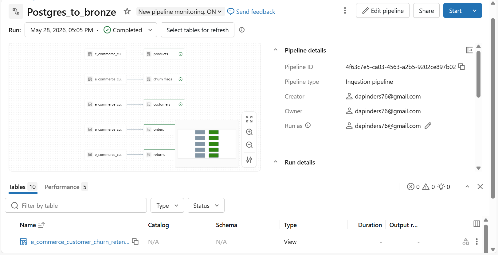
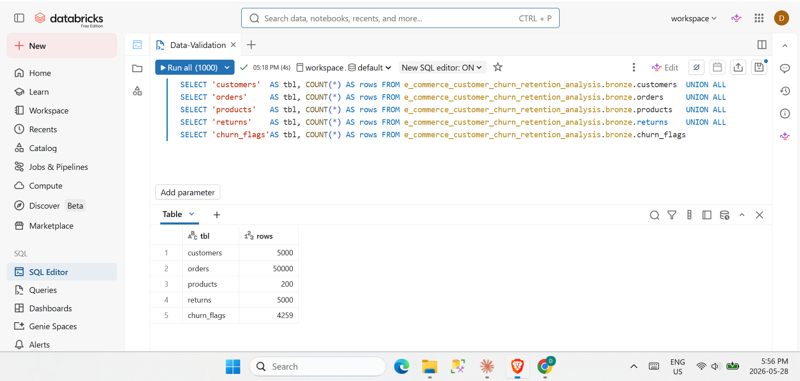
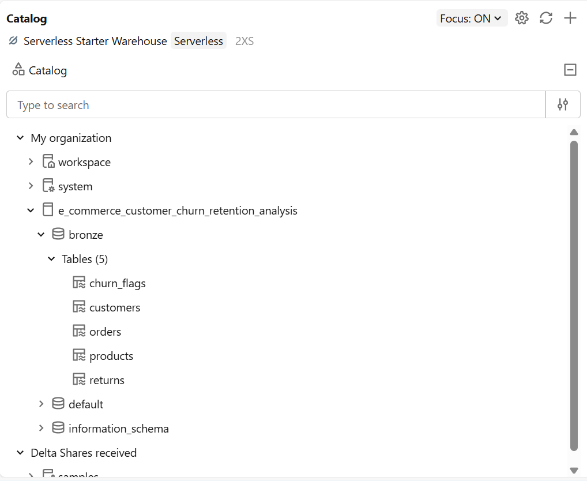

# 🔄 Databricks Lakeflow Ingestion Pipeline

<div align="center">


**Incremental data ingestion from a cloud PostgreSQL database into Databricks Bronze layer**
using the Lakeflow Ingestion Pipeline — no code, no manual watermarks, no complexity.

*Part of the [ShopEase E-Commerce Churn & Retention Analysis](https://github.com/Dapinder-BI/ecommerce-churn-analysis) project*

</div>

---

## 🎯 Problem Statement

> Transactional databases are always live — data is being inserted and updated constantly.
> A simple "load everything every time" approach wastes compute, takes longer with every run,
> and does not scale. The challenge is to build a pipeline that **only processes what is new
> or changed** since the last run — reliably, automatically, and without writing ETL code.

---

## 💡 Solution

**Databricks Lakeflow Ingestion Pipeline** — a no-code ingestion feature that connects directly
to a PostgreSQL source, detects new and updated rows automatically, and lands them into
Bronze Delta tables in Unity Catalog.

---

## 🏗️ Architecture

```
┌──────────────────────────────────────┐
│         Neon PostgreSQL              │
│         (OLTP Source)                │
│                                      │
│  customers  │  orders  │  products   │
│  returns    │  churn_flags           │
└─────────────────┬────────────────────┘
                  │
                  │  ⚡ Lakeflow Ingestion Pipeline
                  │  ├─ Cursor column   →  updated_at
                  │  ├─ Sync mode       →  Incremental
                  │  ├─ Compute         →  Serverless
                  │  └─ Duration        →  53 seconds
                  │
                  ▼
┌──────────────────────────────────────┐
│      Databricks Unity Catalog        │
│                                      │
│  Catalog : e_commerce_customer_      │
│            churn_retention_analysis  │
│  Schema  : bronze                    │
│                                      │
│  ✅ customers    · Streaming Table   │
│  ✅ orders       · Streaming Table   │
│  ✅ products     · Streaming Table   │
│  ✅ returns      · Streaming Table   │
│  ✅ churn_flags  · Streaming Table   │
└──────────────────────────────────────┘
```

---

## 📸 Screenshots

### Pipeline Flow — All 5 tables ingested successfully


---

### Row Count Verification — SQL Editor


---

### Catalog View — Bronze schema with all 5 tables


---

## 🌊 What are Streaming Tables?

When Lakeflow creates Bronze tables, it creates them as **Streaming Tables**.
Understanding why matters.

### The difference

```
❌  Traditional Batch Load
    Run 1 → Process ALL rows ──────────────────► Bronze
    Run 2 → Process ALL rows ──────────────────► Bronze  (reprocessed everything)
    Run 3 → Process ALL rows ──────────────────► Bronze  (slow, wasteful)

✅  Streaming Table (Lakeflow)
    Run 1 → Process ALL rows ──────────────────► Bronze
    Run 2 → Process only NEW rows ─────────────► Bronze  (fast, efficient)
    Run 3 → Process only CHANGED rows ─────────► Bronze  (only what changed)
```

### How it works

| Concept | Explanation |
|---------|-------------|
| **Cursor column** | `updated_at` — Lakeflow checks this timestamp to find rows newer than the last run |
| **Checkpoint** | The pipeline remembers exactly where it left off — automatically |
| **Fault tolerant** | If the pipeline fails mid-run, it resumes from the checkpoint — no duplicates |

> **Key point:** Streaming Tables describe *how data gets in* — not how you read it.
> In Silver notebooks, they are queried exactly like any regular Delta table.

---

## 🗂️ SCD Type 1 vs SCD Type 2

This was the most important configuration decision — each table needed to be evaluated
based on what its data represents.

### What is SCD?

**Slowly Changing Dimension (SCD)** defines how a pipeline handles changes to data over time.

| | SCD Type 1 | SCD Type 2 |
|--|-----------|-----------|
| **Behaviour** | Overwrite — keep only current state | Track history — keep all versions |
| **Extra columns** | None | `__START_AT`, `__END_AT`, `__CURRENT` |
| **Use case** | Immutable events | Entities that change over time |
| **Lakeflow setting** | History Tracking OFF | History Tracking ON |

---

### ⬛ History Tracking OFF → SCD Type 1

**Applied to:** `orders` · `returns`

These tables record **events** — something that happened at a point in time.
An order placed is permanent. A return processed is permanent.
There is no meaningful history to track — the event itself does not change.

```
orders (SCD Type 1) — only current state stored:
  order_id=1001  status=Completed  amount=250.00  ← clean, simple
```

---

### 🟦 History Tracking ON → SCD Type 2

**Applied to:** `customers` · `products` · `churn_flags`

These tables describe **entities** — things that evolve over time, and that evolution is
analytically valuable.

| Table | What changes | Why history matters |
|-------|-------------|---------------------|
| `customers` | Segment (New → Regular → Premium), email, city | Understand when a customer was upgraded |
| `products` | Price, description | Historical prices affect accurate revenue analysis |
| `churn_flags` | Churn segment (Active → At Risk → Churned) | Track a customer's journey toward churn |

**System columns added automatically by Lakeflow:**

| Column | Meaning |
|--------|---------|
| `__START_AT` | When this version of the record became active |
| `__END_AT` | When it was replaced — `NULL` means still current |
| `__CURRENT` | `True` = latest version of this record |

**Example — a customer's segment history:**

```
customer_id=101  segment=New      __START_AT=2023-01-15  __END_AT=2023-08-01  __CURRENT=False
customer_id=101  segment=Regular  __START_AT=2023-08-01  __END_AT=2024-03-10  __CURRENT=False
customer_id=101  segment=Premium  __START_AT=2024-03-10  __END_AT=NULL        __CURRENT=True
```

**Reading SCD Type 2 tables in Silver — filter for current records only:**

```python
df = spark.read.format("delta") \
    .table("e_commerce_customer_churn_retention_analysis.bronze.customers") \
    .filter("__CURRENT = true")
```

---

## ⚙️ Pipeline Configuration

### Connection

| Setting | Value |
|---------|-------|
| Source type | PostgreSQL |
| Host | Neon pooler endpoint |
| SSL mode | Required |
| Compute | Databricks Serverless |

### Table Settings

| Table | Primary Key | Cursor Column | History Tracking | SCD Type |
|-------|-------------|---------------|-----------------|----------|
| `customers` | `customer_id` | `updated_at` | ✅ ON | Type 2 |
| `orders` | `order_id` | `updated_at` | ❌ OFF | Type 1 |
| `products` | `product_id` | `updated_at` | ✅ ON | Type 2 |
| `returns` | `return_id` | `updated_at` | ❌ OFF | Type 1 |
| `churn_flags` | `customer_id` | `updated_at` | ✅ ON | Type 2 |

---

## ✅ Pipeline Result

| Metric | Result |
|--------|--------|
| Status | ✅ Completed |
| Errors | 0 |
| Warnings | 0 |
| Compute | Serverless |
| Tables loaded | 5 / 5 |

---

## 🛠️ Tech Stack

| Tool | Role |
|------|------|
| **Neon PostgreSQL** | Cloud-hosted OLTP source database |
| **Databricks Free Edition** | Data Lakehouse platform |
| **Lakeflow Ingestion Pipeline** | No-code incremental ingestion |
| **Delta Lake** | Open table format for Bronze layer |
| **Unity Catalog** | Data governance and cataloging |
| **Databricks Serverless** | Auto-scaling compute |

---

